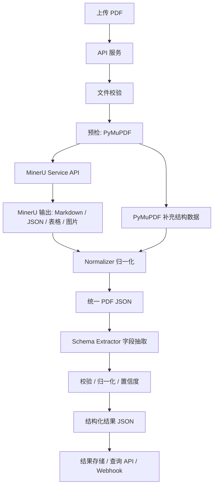
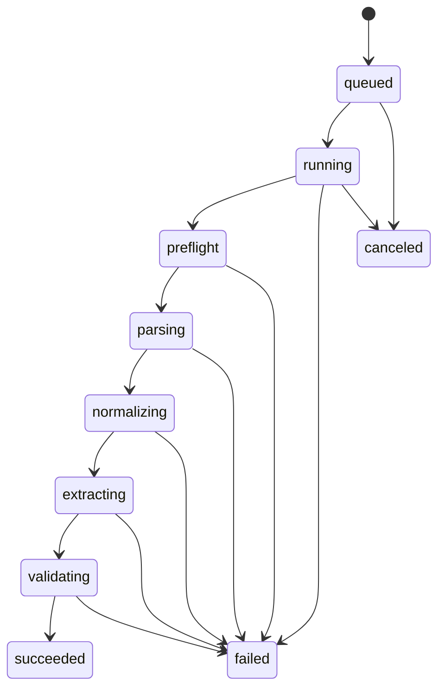

# PDF 文档解析服务技术方案

## 1. 背景

本项目一期建设一个只面向 PDF 的文档解析服务，用于从上传的 PDF 文件中提取结构化业务数据。DOCX 及其他文件格式不纳入一期范围，后续可在统一模型之上扩展。

本服务不以高保真页面还原或坐标级版面输出为核心目标。核心目标是把 PDF 内容转换为统一的中间结构，再根据可配置的业务 Schema 抽取目标字段。

## 2. 目标

- 支持 PDF 文件上传并创建解析任务。
- 提取文本、表格、图片、原生 PDF 表单字段、附件、元数据和必要诊断信息。
- 优先使用原生/文档解析能力，仅在页面可提取文本不足或需要视觉识别时触发 OCR。
- 使用独立部署的 MinerU API 服务作为主要 PDF 内容解析引擎。
- 使用 PyMuPDF 作为 PDF 预检、结构补充解析器和本地文本兜底。
- 将所有解析器输出统一归一为内部 JSON 模型。
- 在通用解析结果之上支持基于 Schema 的结构化字段抽取。
- 提供字段校验、格式归一化、来源追踪和置信度评分。
- 持久化原始文件、派生资产、解析结果、抽取结果和任务状态。

## 3. 一期不做

- DOCX、PPTX、XLSX、图片文件上传或通用多格式解析。
- 像素级 PDF 页面还原。
- 以坐标为核心的一期公开 API。
- XFA 表单的完整渲染和深度语义解析。
- 人工复核与标注平台。
- 模型训练闭环。
- 实时协同编辑或文档预览 UI。

## 4. 推荐架构



服务采用分层架构：

1. API 与任务层：文件上传、任务创建、状态查询、结果查询、回调管理。
2. 解析层：独立 MinerU 服务负责主内容解析，PyMuPDF 负责预检、补充结构数据和文本兜底。
3. 归一化层：将不同解析器输出转换为稳定的内部文档模型。
4. 抽取层：根据业务 Schema 进行字段抽取。
5. 校验层：字段类型校验、格式归一化、置信度评分和告警生成。
6. 存储层：原始文件、生成资产、中间 JSON、最终 JSON 和任务元数据。

## 5. 模块职责

### 5.1 API 服务

推荐技术栈：FastAPI。

职责：

- 上传 PDF 文件。
- 创建解析任务。
- 查询任务状态。
- 查询通用解析结果。
- 触发 Schema 字段抽取。
- 管理抽取 Schema。
- 提供批量解析入口。
- 注册解析完成回调。

### 5.2 文件校验

职责：

- 校验文件类型和扩展名。
- 限制文件大小和页数。
- 检测加密 PDF。
- 检测损坏或不可读 PDF。
- 生成文件 hash，用于去重和追踪。
- 将原始文件存入对象存储。

### 5.3 预检解析器

推荐库：PyMuPDF。

职责：

- 提取页数、页面尺寸、页面旋转、PDF 元数据，以及可获得的 PDF 版本信息。
- 检测加密状态和权限问题。
- 提取原生 AcroForm 表单字段。
- 检测是否存在 XFA 表单。
- 提取嵌入附件。
- 按需提取目录/书签。
- 在启用时收集批注信息。
- 为解析降级和诊断提供辅助信息。

### 5.4 MinerU 主解析器

MinerU 是主要 PDF 内容解析器，推荐独立部署为 API 服务，不与主 API 进程共享运行时。

职责：

- 通过 `mineru-api` 提供 HTTP `/file_parse` 接口，接收 `multipart/form-data`，PDF 文件字段名为 `files`。
- 按阅读顺序提取文本。
- 生成 Markdown 和结构化 JSON 输出。
- 提取表格并尽量保留表格结构。
- 提取图片和文档视觉元素。
- 对扫描件 PDF 或乱码 PDF 使用 OCR。
- 相比低层 PDF 文本抽取，更好地处理复杂版式。

主 API 通过 `DOCPARSER_MINERU_SERVICE_URL` 配置完整请求地址，例如 `http://mineru-service:8000/file_parse`。该配置存在时优先使用远程服务；未配置时可使用本地命令 adapter；两者都没有时使用 PyMuPDF 文本兜底。

MinerU 输出不直接作为最终业务结果，而是作为归一化文档内容的主要来源。

### 5.5 PyMuPDF 补充解析器

职责：

- 执行 PDF 预检：文件可读性、加密状态、页数、页面尺寸、旋转和元数据。
- 当 MinerU 图片输出不完整时补充提取嵌入图片资产。
- 渲染页面，用于 OCR 诊断、调试或兜底流程。
- 提取 Widget/Form 数据，用于原生表单字段策略。
- 提取嵌入附件的基础元数据。
- 在启用时读取批注。
- 提供页面级诊断信息，例如文本密度和页面可渲染性。

### 5.6 Normalizer 归一化器

职责：

- 合并 MinerU 和 PyMuPDF 的输出。
- 对重复的图片、表单和元数据做去重。
- 将解析器特有数据转换为稳定的内部 Schema。
- 为关键内容单元保留来源信息。
- 对局部失败生成 warning，而不是静默丢弃。

### 5.7 Schema Extractor 字段抽取器

职责：

- 基于归一化后的 PDF JSON 执行业务字段抽取。
- 支持按文档类型配置 Schema。
- 支持多种抽取策略：
  - 正则和关键词邻近抽取；
  - 原生表单字段映射；
  - 表格列映射；
  - 基于 Markdown/文本块的章节抽取；
  - 可选的 LLM/模型辅助抽取，需封装在统一接口之后。
- 返回字段值、来源、置信度和校验状态。

### 5.8 Validator 校验器

职责：

- 校验字段类型：string、date、money、number、enum、boolean、array、object。
- 归一化日期、数字、金额和标识符。
- 应用 required/optional 规则。
- 生成缺失字段和低置信度 warning。
- 保留非法原始值，便于审计和排查。

## 6. 数据模型

### 6.1 统一解析结果

```json
{
  "document_id": "doc_001",
  "file": {
    "name": "sample.pdf",
    "sha256": "9c1b...",
    "size_bytes": 102400,
    "mime_type": "application/pdf"
  },
  "document": {
    "file_type": "pdf",
    "page_count": 12,
    "encrypted": false,
    "parse_mode": "native|ocr|mixed",
    "metadata": {},
    "warnings": []
  },
  "content": {
    "markdown": "",
    "text_blocks": [],
    "tables": [],
    "forms": [],
    "images": [],
    "attachments": [],
    "annotations": []
  },
  "sources": [
    {
      "engine": "mineru",
      "version": "x.y.z",
      "status": "success"
    }
  ]
}
```

### 6.2 文本块

```json
{
  "block_id": "txt_001",
  "type": "heading|paragraph|list_item|footer|header|unknown",
  "text": "合同编号：HT-2026-001",
  "page_no": 1,
  "source": "mineru",
  "confidence": 0.98
}
```

如果解析器提供坐标信息，可以在内部保留；但一期公开 API 不依赖坐标。

### 6.3 表格

```json
{
  "table_id": "tbl_001",
  "name": "table_1",
  "page_no": 2,
  "headers": ["品名", "数量", "金额"],
  "rows": [
    ["A", "2", "100.00"]
  ],
  "html": "<table>...</table>",
  "markdown": "| 品名 | 数量 | 金额 |",
  "source": "mineru",
  "confidence": 0.9
}
```

### 6.4 表单字段

```json
{
  "field_id": "form_001",
  "name": "contract_no",
  "label": "合同编号",
  "value": "HT-2026-001",
  "field_type": "text",
  "page_no": 1,
  "source": "pymupdf.widget",
  "confidence": 1.0
}
```

原生 PDF 表单字段的可信度高于从普通文本中推断出的键值对。

### 6.5 图片

```json
{
  "image_id": "img_001",
  "page_no": 3,
  "storage_key": "documents/doc_001/images/img_001.png",
  "sha256": "ab12...",
  "width": 800,
  "height": 600,
  "format": "png",
  "caption": null,
  "source": "mineru|pymupdf"
}
```

### 6.6 附件

```json
{
  "attachment_id": "att_001",
  "name": "appendix.xlsx",
  "storage_key": "documents/doc_001/attachments/appendix.xlsx",
  "sha256": "cd34...",
  "size_bytes": 20480,
  "source": "pymupdf"
}
```

## 7. 合并与去重规则

| 数据类型 | 主来源 | 补充来源 | 合并规则 |
| --- | --- | --- | --- |
| 文本与阅读顺序 | MinerU | PyMuPDF 兜底 | 优先使用 MinerU。仅在 MinerU 失败或文本明显不足时使用 PyMuPDF 兜底。 |
| 表格 | MinerU | 后续可选表格兜底 | 优先使用 MinerU。可用时同时保留 HTML、Markdown 和二维单元格矩阵。 |
| 图片 | MinerU | PyMuPDF | 按 sha256 去重。两者都存在时，保留 MinerU 的语义/说明信息和 PyMuPDF 的资产诊断信息。 |
| 原生表单 | PyMuPDF | 文本策略兜底 | 原生 PDF 字段值优先于文本推断的键值对。 |
| 元数据 | PyMuPDF | MinerU 原始诊断 | 以 PyMuPDF 预检元数据为准，保留 MinerU 原始诊断用于排查。 |
| 附件 | PyMuPDF | 后续可选附件服务 | 按文件名和 sha256 去重。 |
| 批注 | PyMuPDF | 后续可选增强 | 作为可选辅助内容保留。 |

## 8. Schema 字段抽取

Schema 描述业务目标字段，与具体 PDF 解析引擎解耦。

示例：

```json
{
  "schema_id": "contract_v1",
  "name": "合同字段抽取",
  "fields": [
    {
      "name": "contract_no",
      "label": "合同编号",
      "type": "string",
      "required": true,
      "strategies": [
        {
          "type": "form_field",
          "field_names": ["contract_no", "合同编号"]
        },
        {
          "type": "regex",
          "pattern": "合同编号[:：\\s]*([A-Za-z0-9\\-]+)"
        }
      ],
      "confidence_threshold": 0.8
    }
  ]
}
```

抽取器应优先执行确定性策略。LLM 或模型辅助抽取可以在基线规则效果可衡量之后，以 provider 接口形式引入。

## 9. API 设计

### 9.1 上传 PDF

`POST /documents`

请求：

- multipart file：PDF 文件
- 可选 parse options
- 可选 schema id，用于上传后立即抽取

响应：

```json
{
  "document_id": "doc_001",
  "task_id": "task_001",
  "status": "queued"
}
```

### 9.2 查询任务

`GET /tasks/{task_id}`

响应：

```json
{
  "task_id": "task_001",
  "document_id": "doc_001",
  "status": "queued|running|succeeded|failed|canceled",
  "progress": 60,
  "error": null
}
```

### 9.3 查询通用解析结果

`GET /documents/{document_id}/parse-result`

返回统一解析结果。

### 9.4 触发 Schema 抽取

`POST /documents/{document_id}/extract`

请求：

```json
{
  "schema_id": "contract_v1"
}
```

响应：

```json
{
  "extraction_id": "ext_001",
  "status": "queued"
}
```

### 9.5 查询抽取结果

`GET /extractions/{extraction_id}`

响应：

```json
{
  "extraction_id": "ext_001",
  "document_id": "doc_001",
  "schema_id": "contract_v1",
  "fields": {
    "contract_no": {
      "value": "HT-2026-001",
      "normalized_value": "HT-2026-001",
      "confidence": 0.95,
      "source": "form|text|table|model",
      "status": "valid"
    }
  },
  "warnings": []
}
```

### 9.6 管理 Schema

- `POST /schemas`
- `GET /schemas`
- `GET /schemas/{schema_id}`
- `PUT /schemas/{schema_id}`
- `DELETE /schemas/{schema_id}`

## 10. 任务状态机



如果上传时没有指定 Schema，任务可以在完成通用解析后进入 `succeeded`。后续可单独触发 Schema 抽取任务。

## 11. 存储设计

推荐存储：

- PostgreSQL：保存任务元数据、文档记录、Schema、解析结果元数据和抽取结果元数据。
- PostgreSQL JSONB：在结果大小适中时保存解析 JSON 和抽取 JSON。
- MinIO/S3 兼容对象存储：保存原始 PDF、提取图片、附件、大型中间 JSON 和渲染页面图片。
- Redis：使用 RQ 时保存任务队列状态；使用 Celery 时可用 Redis/RabbitMQ。

核心表：

- `documents`：文档 id、文件元数据、存储 key、hash、页数、创建时间。
- `parse_tasks`：任务 id、文档 id、状态、进度、错误、解析器版本。
- `parse_results`：文档 id、结果存储 key 或 JSONB、解析模式、warning。
- `schemas`：schema id、名称、版本、JSON 定义、启用标记。
- `extraction_tasks`：抽取 id、文档 id、schema id、状态、错误。
- `extraction_results`：抽取 id、抽取 JSON、校验摘要。

## 12. 错误处理

常见错误类型：

- `INVALID_FILE_TYPE`
- `FILE_TOO_LARGE`
- `PAGE_LIMIT_EXCEEDED`
- `PDF_ENCRYPTED`
- `PDF_CORRUPTED`
- `PARSER_FAILED`
- `MINERU_FAILED`
- `PREFLIGHT_FAILED`
- `NORMALIZE_FAILED`
- `SCHEMA_NOT_FOUND`
- `EXTRACTION_FAILED`
- `VALIDATION_FAILED`

如果解析器局部失败但仍能返回有价值内容，应以 warning 表示，而不是直接让整份文档失败。

## 13. 可观测性

需要跟踪：

- 解析任务数量、成功率、失败率；
- 平均解析耗时；
- 触发 OCR 的文档/页面比例；
- MinerU 失败率；
- 补充解析器失败率；
- 抽取字段缺失率；
- 低置信度字段比例；
- 队列深度和 Worker 延迟；
- 文件大小和页数分布。

日志应包含 document id、task id、解析器版本、解析模式和错误码。默认不记录敏感字段值。

## 14. 安全与合规

- 限制上传文件大小和页数。
- 如果需要多租户，文件应存储在租户或项目隔离的对象路径下。
- 避免在日志中记录敏感抽取值。
- 提取图片和附件通过签名 URL 或鉴权下载 API 访问。
- 解析器运行在受资源限制的 Worker 进程中。
- 保存解析器版本信息，保证结果可追溯。
- 支持可配置的文件保留策略。

## 15. 一期交付范围

一期应交付：

1. PDF 上传与任务创建。
2. 基于 PyMuPDF 的 PDF 预检。
3. 基于独立 MinerU API 服务的 PDF 解析。
4. 表单、元数据、附件和图片的补充抽取。
5. 统一解析 JSON。
6. Schema 定义和基于 Schema 的字段抽取。
7. 字段校验、格式归一化、置信度和 warning。
8. PostgreSQL 与对象存储持久化。
9. 基础重试、失败处理和可观测性。

## 16. 建议里程碑

### 里程碑 1：解析服务骨架

- FastAPI 上传和任务 API。
- 本地/对象存储抽象。
- PDF 校验和任务状态模型。
- 基础 PyMuPDF 预检。

### 里程碑 2：MinerU Service 集成

- MinerU HTTP 客户端封装。
- `DOCPARSER_MINERU_SERVICE_URL` 配置。
- 本地命令 adapter 作为开发兼容路径。
- 解析结果采集。
- Markdown/JSON/表格/图片接入。
- 解析器版本和 warning 捕获。

### 里程碑 3：统一 PDF 模型

- 统一解析结果 Schema。
- MinerU 和 PyMuPDF 的合并规则。
- 图片、表单、附件、元数据去重。

### 里程碑 4：Schema 字段抽取

- Schema CRUD。
- 正则、表单字段、关键词和表格列抽取策略。
- 校验和置信度评分。

### 里程碑 5：生产就绪

- 异步队列和 Worker 部署。
- 重试和超时策略。
- 指标、结构化日志和错误码覆盖。
- 使用代表性 PDF 样本做集成测试。

## 17. 一期实现默认策略

一期先采用以下默认策略。等真实样本规模和部署约束明确后，再将其配置化。

- 文件大小限制：单个 PDF 不超过 100 MB。
- 页数限制：单个 PDF 不超过 300 页。
- MinerU 执行方式：生产环境优先调用 `mineru-api` 服务，主 API 通过 `DOCPARSER_MINERU_SERVICE_URL` 配置完整 `/file_parse` 请求地址；本地开发可使用 `DOCPARSER_MINERU_COMMAND` adapter；两者都未配置时使用 PyMuPDF 文本兜底。
- 加速目标：主 API 保持轻量 CPU 部署；MinerU 服务可独立配置 CPU/GPU、大内存、长超时和并发队列。
- Schema 范围：项目级 Schema。这样既能满足一期使用，也为后续多租户留出空间。
- 资产访问：提取图片和附件通过鉴权 API 返回。若后续需要对象存储直连，再增加签名 URL。
- OCR 策略：页级降级。仅当页面原生/MinerU 文本质量不足，或 MinerU 判断需要视觉/OCR 解析时，才对该页执行 OCR。

## 18. 最终建议

一期使用独立 MinerU API 服务作为主要 PDF 内容解析器，使用 PyMuPDF 作为预检、结构补充解析器和文本兜底。不要把任何解析器的原始输出直接暴露为业务 API，而是先统一归一到稳定的内部 PDF JSON 模型，再在其上执行基于 Schema 的业务字段抽取。

这个方案可以让一期聚焦 PDF 解析，同时为后续扩展 DOCX 或其他格式保留清晰路径。
