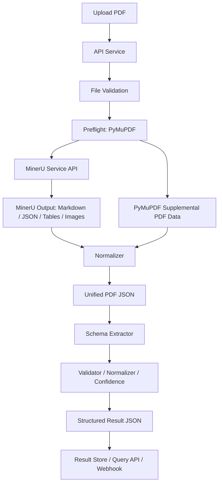
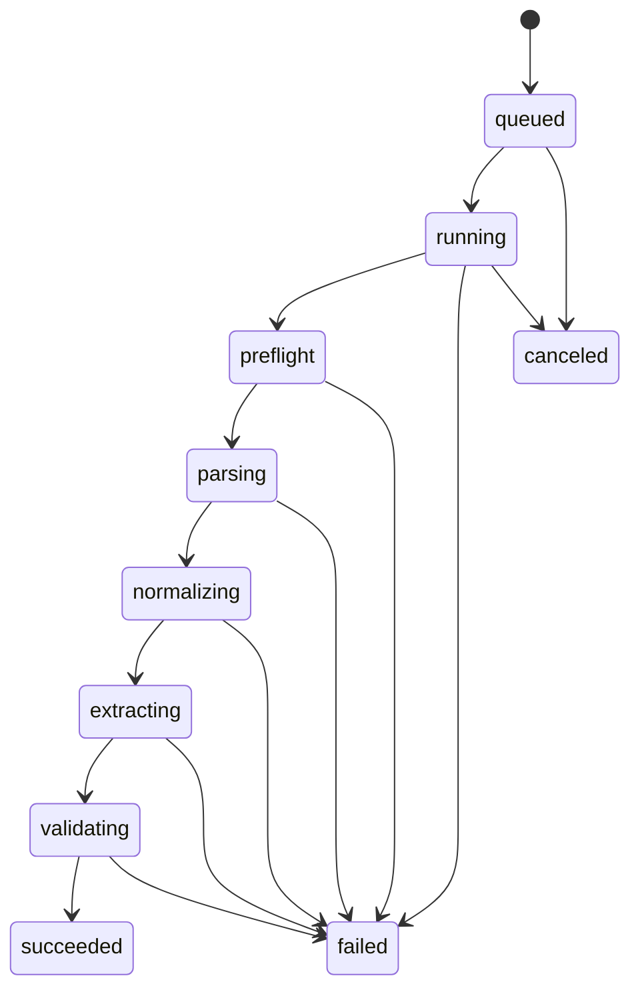

# PDF Document Parsing Service Design

## 1. Background

This project will build a PDF-only document parsing service for extracting structured business data from uploaded PDF files. The first release focuses on PDF parsing only. DOCX and other file formats are explicitly deferred to later phases.

The service does not prioritize high-fidelity page reconstruction or coordinate-level layout output. Its main goal is to convert PDF content into normalized intermediate structures and then extract business fields according to configurable schemas.

## 2. Goals

- Accept PDF uploads and create parsing tasks.
- Extract text, tables, images, native PDF form fields, attachments, metadata, and useful diagnostics.
- Prefer native/document parsing and only use OCR when a PDF page has insufficient extractable text or requires visual recognition.
- Use an independently deployed MinerU API service as the primary PDF content parsing engine.
- Use PyMuPDF for PDF preflight, supplemental structure extraction, and local text fallback.
- Normalize all parser outputs into a unified internal JSON model.
- Support schema-based structured field extraction after generic parsing.
- Provide field validation, normalization, source attribution, and confidence scoring.
- Store original files, derived assets, parsing results, extraction results, and task state.

## 3. Non-Goals For Phase 1

- DOCX, PPTX, XLSX, image-only uploads, or general multi-format parsing.
- Pixel-perfect PDF layout reconstruction.
- Coordinate-first extraction APIs.
- Full XFA form rendering and deep XFA semantic extraction.
- A human review and annotation platform.
- Model training workflows.
- Real-time collaborative editing or document preview UI.

## 4. Recommended Architecture



The service uses a layered architecture:

1. API and task layer: file upload, task creation, status query, result query, callback management.
2. Parsing layer: independent MinerU service for primary content parsing, with PyMuPDF for preflight, supplemental structure data, and text fallback.
3. Normalization layer: converts all parser outputs into one stable internal document model.
4. Extraction layer: schema-driven business field extraction.
5. Validation layer: type checks, format normalization, confidence scoring, and warning generation.
6. Storage layer: original files, generated assets, intermediate JSON, final JSON, and task metadata.

## 5. Component Responsibilities

### 5.1 API Service

Recommended stack: FastAPI.

Responsibilities:

- Upload PDF files.
- Create parse tasks.
- Query task status.
- Query generic parse results.
- Trigger schema extraction.
- Manage extraction schemas.
- Provide batch parsing entry points.
- Register completion webhooks.

### 5.2 File Validation

Responsibilities:

- Verify file type and extension.
- Enforce file size and page count limits.
- Detect encrypted PDFs.
- Detect corrupted or unreadable PDFs.
- Generate file hash for deduplication and traceability.
- Store the original file in object storage.

### 5.3 Preflight Parser

Recommended library: PyMuPDF.

Responsibilities:

- Extract page count, page sizes, rotations, PDF metadata, and PDF version where available.
- Detect encryption and permission issues.
- Extract native AcroForm fields.
- Detect whether an XFA form exists.
- Extract embedded attachments.
- Extract document outlines/bookmarks if needed.
- Collect annotations if enabled.
- Provide diagnostics for parser fallback decisions.

### 5.4 MinerU Main Parser

MinerU is the primary PDF content parser. It should be deployed as an independent API service instead of sharing the main API runtime.

Responsibilities:

- Use `mineru-api` to provide the HTTP `/file_parse` endpoint, which accepts `multipart/form-data` with the PDF file field named `files`.
- Extract text in reading order.
- Produce Markdown and structured JSON outputs.
- Extract tables and preserve table structure.
- Extract images and document visual elements.
- Handle scanned PDFs or garbled PDFs through OCR.
- Handle complex layouts better than low-level PDF text extraction alone.

The main API configures the full request URL through `DOCPARSER_MINERU_SERVICE_URL`, for example `http://mineru-service:8000/file_parse`. When this setting exists, it takes precedence over the local command adapter. If neither the service URL nor the local command is configured, the API uses PyMuPDF text fallback.

MinerU output should not be treated as the final business result. It is the main source for normalized document content.

### 5.5 PyMuPDF Supplemental Parser

Responsibilities:

- Run PDF preflight: readability, encryption state, page count, page sizes, rotations, and metadata.
- Extract embedded image assets when MinerU output is incomplete.
- Render pages for OCR diagnostics, debugging, or fallback workflows.
- Extract widget/form data for native form-field strategies.
- Extract basic embedded-attachment metadata.
- Read annotations when enabled.
- Provide page-level diagnostics such as text density and renderability.

### 5.6 Normalizer

Responsibilities:

- Merge MinerU and PyMuPDF outputs.
- Deduplicate overlapping images, forms, and metadata.
- Convert parser-specific data into a stable internal schema.
- Preserve source attribution for every important content unit.
- Attach warnings instead of silently dropping partial failures.

### 5.7 Schema Extractor

Responsibilities:

- Run business field extraction against the normalized PDF JSON.
- Support configurable schemas by document type.
- Support multiple extraction strategies:
  - regex and keyword proximity extraction,
  - native form field mapping,
  - table column mapping,
  - section-based extraction from Markdown/text blocks,
  - optional LLM/model-assisted extraction behind an interface.
- Return extracted values with source, confidence, and validation status.

### 5.8 Validator

Responsibilities:

- Validate field types: string, date, money, number, enum, boolean, array, object.
- Normalize dates, numbers, amounts, and identifiers.
- Apply required/optional rules.
- Generate missing-field and low-confidence warnings.
- Keep invalid raw values for auditability.

## 6. Data Model

### 6.1 Unified Parse Result

```json
{
  "document_id": "doc_001",
  "file": {
    "name": "sample.pdf",
    "sha256": "9c1b...",
    "size_bytes": 102400,
    "mime_type": "application/pdf"
  },
  "document": {
    "file_type": "pdf",
    "page_count": 12,
    "encrypted": false,
    "parse_mode": "native|ocr|mixed",
    "metadata": {},
    "warnings": []
  },
  "content": {
    "markdown": "",
    "text_blocks": [],
    "tables": [],
    "forms": [],
    "images": [],
    "attachments": [],
    "annotations": []
  },
  "sources": [
    {
      "engine": "mineru",
      "version": "x.y.z",
      "status": "success"
    }
  ]
}
```

### 6.2 Text Block

```json
{
  "block_id": "txt_001",
  "type": "heading|paragraph|list_item|footer|header|unknown",
  "text": "合同编号：HT-2026-001",
  "page_no": 1,
  "source": "mineru",
  "confidence": 0.98
}
```

Coordinates may be stored internally if a parser provides them, but the public phase-1 API does not depend on coordinates.

### 6.3 Table

```json
{
  "table_id": "tbl_001",
  "name": "table_1",
  "page_no": 2,
  "headers": ["品名", "数量", "金额"],
  "rows": [
    ["A", "2", "100.00"]
  ],
  "html": "<table>...</table>",
  "markdown": "| 品名 | 数量 | 金额 |",
  "source": "mineru",
  "confidence": 0.9
}
```

### 6.4 Form Field

```json
{
  "field_id": "form_001",
  "name": "contract_no",
  "label": "合同编号",
  "value": "HT-2026-001",
  "field_type": "text",
  "page_no": 1,
  "source": "pymupdf.widget",
  "confidence": 1.0
}
```

Native PDF form fields have higher trust than text-derived key-value pairs.

### 6.5 Image

```json
{
  "image_id": "img_001",
  "page_no": 3,
  "storage_key": "documents/doc_001/images/img_001.png",
  "sha256": "ab12...",
  "width": 800,
  "height": 600,
  "format": "png",
  "caption": null,
  "source": "mineru|pymupdf"
}
```

### 6.6 Attachment

```json
{
  "attachment_id": "att_001",
  "name": "appendix.xlsx",
  "storage_key": "documents/doc_001/attachments/appendix.xlsx",
  "sha256": "cd34...",
  "size_bytes": 20480,
  "source": "pymupdf"
}
```

## 7. Merge And Deduplication Rules

| Data Type | Primary Source | Supplemental Source | Merge Rule |
| --- | --- | --- | --- |
| Text and reading order | MinerU | PyMuPDF fallback | Prefer MinerU. Use PyMuPDF only if MinerU fails or returns insufficient text. |
| Tables | MinerU | Optional table fallback later | Prefer MinerU. Preserve HTML, Markdown, and cell matrix when available. |
| Images | MinerU | PyMuPDF | Deduplicate by sha256. If both exist, keep MinerU caption/semantic data and PyMuPDF asset diagnostics. |
| Native forms | PyMuPDF | Text strategy fallback | Prefer native PDF field values over text-derived key-value pairs. |
| Metadata | PyMuPDF | MinerU raw diagnostics | Use PyMuPDF preflight metadata as canonical and keep MinerU raw diagnostics for troubleshooting. |
| Attachments | PyMuPDF | Optional attachment service later | Deduplicate by filename and sha256. |
| Annotations | PyMuPDF | Optional enhancement later | Keep as optional auxiliary content. |

## 8. Schema Extraction

Schemas describe target business fields independently from PDF parsing engines.

Example:

```json
{
  "schema_id": "contract_v1",
  "name": "合同字段抽取",
  "fields": [
    {
      "name": "contract_no",
      "label": "合同编号",
      "type": "string",
      "required": true,
      "strategies": [
        {
          "type": "form_field",
          "field_names": ["contract_no", "合同编号"]
        },
        {
          "type": "regex",
          "pattern": "合同编号[:：\\s]*([A-Za-z0-9\\-]+)"
        }
      ],
      "confidence_threshold": 0.8
    }
  ]
}
```

The extractor should run deterministic strategies first. Model-assisted extraction can be introduced behind a provider interface after baseline rule quality is measured.

## 9. API Design

### 9.1 Upload PDF

`POST /documents`

Request:

- multipart file: PDF
- optional parse options
- optional schema id for immediate extraction

Response:

```json
{
  "document_id": "doc_001",
  "task_id": "task_001",
  "status": "queued"
}
```

### 9.2 Query Task

`GET /tasks/{task_id}`

Response:

```json
{
  "task_id": "task_001",
  "document_id": "doc_001",
  "status": "queued|running|succeeded|failed|canceled",
  "progress": 60,
  "error": null
}
```

### 9.3 Query Generic Parse Result

`GET /documents/{document_id}/parse-result`

Returns the unified parse result.

### 9.4 Trigger Schema Extraction

`POST /documents/{document_id}/extract`

Request:

```json
{
  "schema_id": "contract_v1"
}
```

Response:

```json
{
  "extraction_id": "ext_001",
  "status": "queued"
}
```

### 9.5 Query Extraction Result

`GET /extractions/{extraction_id}`

Response:

```json
{
  "extraction_id": "ext_001",
  "document_id": "doc_001",
  "schema_id": "contract_v1",
  "fields": {
    "contract_no": {
      "value": "HT-2026-001",
      "normalized_value": "HT-2026-001",
      "confidence": 0.95,
      "source": "form|text|table|model",
      "status": "valid"
    }
  },
  "warnings": []
}
```

### 9.6 Manage Schemas

- `POST /schemas`
- `GET /schemas`
- `GET /schemas/{schema_id}`
- `PUT /schemas/{schema_id}`
- `DELETE /schemas/{schema_id}`

## 10. Task State Machine



If no schema is supplied during upload, the task can stop at `succeeded` after generic parsing. Schema extraction can be triggered later as a separate task.

## 11. Storage Design

Recommended storage:

- PostgreSQL for task metadata, document records, schemas, parse result metadata, and extraction metadata.
- PostgreSQL JSONB for parse and extraction JSON when result size is moderate.
- MinIO/S3-compatible object storage for original PDFs, extracted images, attachments, large intermediate JSON, and rendered page images.
- Redis for task queue state if using RQ, or Redis/RabbitMQ if using Celery.

Core tables:

- `documents`: document id, file metadata, storage key, hash, page count, created time.
- `parse_tasks`: task id, document id, state, progress, error, parser versions.
- `parse_results`: document id, result storage key or JSONB, parse mode, warnings.
- `schemas`: schema id, name, version, JSON definition, active flag.
- `extraction_tasks`: extraction id, document id, schema id, state, error.
- `extraction_results`: extraction id, extracted JSON, validation summary.

## 12. Error Handling

Common error classes:

- `INVALID_FILE_TYPE`
- `FILE_TOO_LARGE`
- `PAGE_LIMIT_EXCEEDED`
- `PDF_ENCRYPTED`
- `PDF_CORRUPTED`
- `PARSER_FAILED`
- `MINERU_FAILED`
- `PREFLIGHT_FAILED`
- `NORMALIZE_FAILED`
- `SCHEMA_NOT_FOUND`
- `EXTRACTION_FAILED`
- `VALIDATION_FAILED`

Parser-level partial failures should be represented as warnings when useful output can still be returned.

## 13. Observability

Track:

- parse task count, success rate, failure rate;
- average parsing duration;
- OCR-triggered document/page ratio;
- MinerU failure rate;
- supplemental parser failure rate;
- extraction field missing rate;
- low-confidence field rate;
- queue depth and worker latency;
- file size and page count distributions.

Logs should include document id, task id, parser versions, parse mode, and error code. Logs must not include sensitive field values by default.

## 14. Security And Compliance

- Restrict upload size and page count.
- Store files under tenant-aware or project-aware object paths if multi-tenant support is needed.
- Avoid logging extracted sensitive values.
- Use signed URLs or authenticated download APIs for extracted images and attachments.
- Run parsers in worker processes with resource limits.
- Maintain parser version records for reproducibility.
- Support configurable file retention policies.

## 15. Phase 1 Delivery Scope

Phase 1 should deliver:

1. PDF upload and task creation.
2. PDF preflight using PyMuPDF.
3. MinerU-service-based PDF parsing.
4. Supplemental form, metadata, attachment, and image extraction.
5. Unified parse JSON.
6. Schema definition and schema-based extraction.
7. Field validation, normalization, confidence, and warnings.
8. PostgreSQL and object storage persistence.
9. Basic retry, failure handling, and observability.

## 16. Suggested Milestones

### Milestone 1: Parsing Skeleton

- FastAPI upload and task APIs.
- Local/object storage abstraction.
- PDF validation and task state model.
- Basic PyMuPDF preflight.

### Milestone 2: MinerU Service Integration

- MinerU HTTP client wrapper.
- `DOCPARSER_MINERU_SERVICE_URL` configuration.
- Local command adapter as a development-compatible path.
- Parse result collection.
- Markdown/JSON/table/image ingestion.
- Parser version and warning capture.

### Milestone 3: Normalized PDF Model

- Unified parse result schema.
- Merge rules for MinerU and PyMuPDF.
- Image, form, attachment, metadata deduplication.

### Milestone 4: Schema Extraction

- Schema CRUD.
- Regex, form-field, keyword, and table-column extraction strategies.
- Validation and confidence scoring.

### Milestone 5: Production Readiness

- Async queue and worker deployment.
- Retry and timeout policies.
- Metrics, structured logs, and error code coverage.
- Integration tests with representative PDFs.

## 17. Phase 1 Implementation Defaults

Use the following defaults for phase 1. They can be made configurable after real sample volume and deployment constraints are known.

- File size limit: 100 MB per PDF.
- Page count limit: 300 pages per PDF.
- MinerU execution mode: production deployments call `mineru-api`. The main API configures the full `/file_parse` request URL through `DOCPARSER_MINERU_SERVICE_URL`; local development may use the `DOCPARSER_MINERU_COMMAND` adapter; if neither is configured, the service uses PyMuPDF text fallback.
- Acceleration target: keep the main API lightweight and CPU-friendly; configure CPU/GPU, memory, long timeouts, and parsing concurrency independently on the MinerU service.
- Schema scope: project-scoped schemas. This keeps schema management flexible for future multi-tenant deployments without forcing tenant logic into phase 1.
- Asset access: return extracted images and attachments through authenticated API endpoints. Signed object storage URLs can be added later if direct object access is required.
- OCR policy: page-level fallback. Run OCR only on pages where native/MinerU text quality is insufficient or MinerU reports visual/OCR parsing.

## 18. Final Recommendation

Use an independent MinerU API service as the main PDF content parser and PyMuPDF as the preflight, supplemental structure parser, and text fallback. Do not expose parser-specific output directly as the business API. Instead, normalize all parser outputs into a stable internal PDF JSON model, then run schema-based business extraction on top.

This keeps phase 1 focused on PDF parsing while preserving a clean extension path for DOCX or other formats later.
